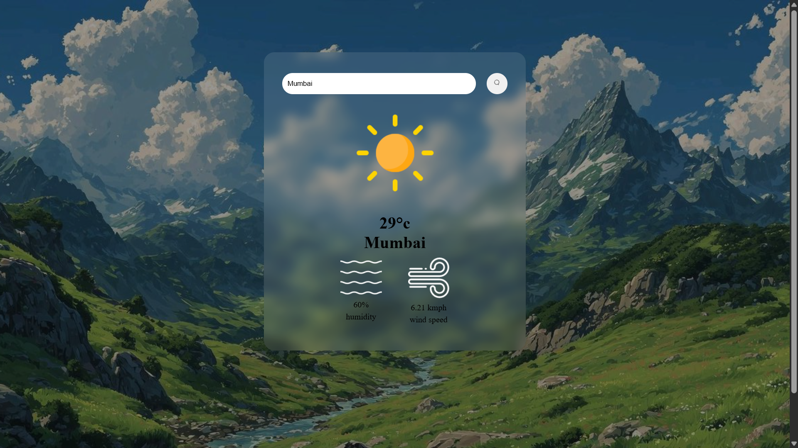

#  Weather App

A simple weather application built using HTML, CSS and JavaScript that fetches real-time weather data using OpenWeather API.

##  Features
- Search weather by city
- Real-time temperature
- Humidity & wind speed
- Dynamic weather icons
- Error handling for invalid cities

##  Tech Stack
- HTML5
- CSS3
- JavaScript (ES6)
- OpenWeather API

##  Preview

